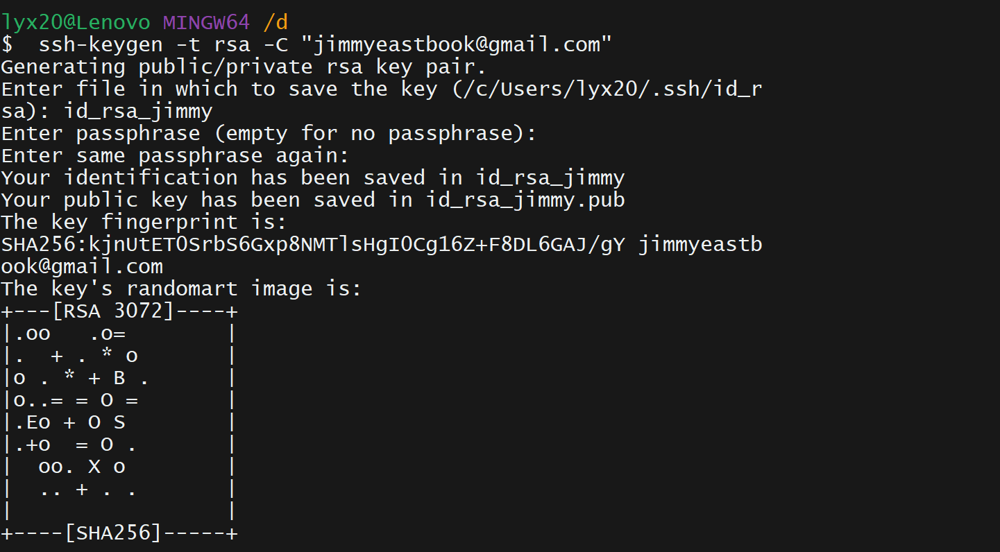
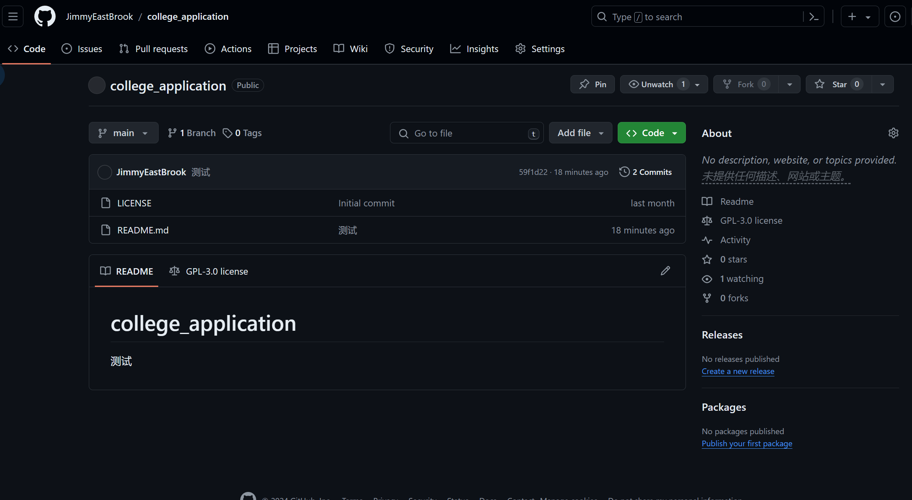

因为我自己本来的账户是zjuee，现在觉得顶着zjuee的昵称似乎不太好，但是github这里没法改，所以我新建一个jimmyeastbrook的账户，然后想要在本地配置两个不同的账户，一个是zjuee，一个是jimmyeastbrook。这样就可以在自己开发的一些小项目中用jimmyeastbrook的账户，<s>而不是顶着zjuee的昵称丢人 😂。（bushi）</s>

## 重新覆盖自己原有的账号

```bash
git configure --global user.name "lyx"
git configure --global user.email "lyx@xxx.xxx"
```

{width=40%,height=40px}

反正这里配置两个假的名字就好了

## 生成新账号的ssh key

```bash
ssh-keygen -t rsa -C "jimmyeastbook@gmail.com"
```

{width=80%,height=60%}

## 添加新账号的ssh key到github

```bash
ssh-agent bash
ssh-add ~/.ssh/id_rsa_jimmyeastbrook
```

{width=60%}

我在d盘中git bash的，生成的sshkey就存储在d盘中。

按照上面的方法我们添加的地点是在c盘的.ssh/id_rsa_jimmy中，这样就得手动把公钥和私钥都转移到c盘相应的文件夹中（不转移的话上面的配置地址就要改一改）

个人支持手动转移，或者直接在c盘生成sshkey，毕竟d盘的东西不小心就被删掉了，配置一遍太麻烦

## 配置~/.ssh/config文件

前面我们在~/.ssh目录下面，使用ssh-keygen -C “your_email” -t rsa 生成公私秘钥，当有多个github账号的时候，可以生成多组rsa的公司密钥。然后配置~/.ssh/config文件（如果没有的话请重新创建一个）。

可以使用`touch config`直接创建，也可以vscode直接创建

```bash
# github 主账号的配置
Host github
    User git
    Hostname github.com
    PreferredAuthentications publickey
    IdentityFile ~/.ssh/id_rsa
# github 新账号的配置
Host github_jimmy
    User git
    Hostname github.com
    PreferredAuthentications publickey
    IdentityFile ~/.ssh/id_rsa_jimmy
```

这里的Host是自定义的，可以自己取名，比如github_zjuee，github_jimmyeastbrook。User git是固定的，Hostname是github.com，IdentityFile是你的私钥文件路径。

## 验证配置是否成功

```bash
ssh -T git@github.com
```

如果成功，会出现：


## 使用

我们先clone一个仓库过来

```bash
git clone git@github.com:[url]
```

然后一堆add之后commit，系统会提示

```bash
Author identity unknown

*** Please tell me who you are.

Run

  git config --global user.email "you@example.com"
  git config --global user.name "Your Name"

to set your account's default identity.
Omit --global to set the identity only in this repository.

fatal: unable to auto-detect email address (got 'lyx20@Lenovo.(none)')

```

这就是因为我们在本地没有配置邮箱和名字，所以git不知道是谁提交的。

本来应该是这样的

```bash
git config --global user.email "jimmyeastbrook@gmail.com"
git config --global user.name "jimmyeastbrook"
```

但是我们想用两个（多个）账号

所以不能全局设置账号，只能对于不同的仓库设置不同的user.name和user.email

```bash
git config user.email "jimmyeastbrook@gmail.com"
git config user.name "jimmyeastbrook"
```

这样就设置了当前仓库的user.name和user.email，下次提交的时候就会用这个账号了。


成功
