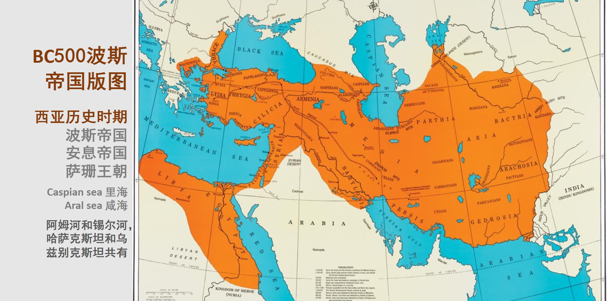

# 历史

## 第二讲，凿空西域
兵俑一般高30－50厘米，马俑通长70厘米，高60厘米。陶质兵马俑都绘以色彩。陶兵俑通常是先用白粉作底色，再在衣领、袖边涂红色，也有少数兵士俑的铠甲部位涂黑色。整体兵马俑军阵品类丰富，计有十余种
虽然文献中没有记载兵马俑的作者是谁，但近20年来，考古学家在兵马俑身上发现了一些文字，由此发现兵马俑的作者原来就是秦代的陶工。兵马俑的模件化制作工艺。来自宫廷及地方的陶工的生活阅历和师承关系的差异，带来不同的艺术风格和技巧。

中国拉车的家马也应当是从西方传播而来的。考古资料表明，中国新石器时代的遗址中很少有马发现，而且基本情况不明，无法确定是野马还是家马。在商代早期及中期出土的动物骨骼中，“值得注意的是在被鉴定的十几种动物的骨骼中没有发现一块马骨”。在商代晚期（公元前13世纪后期开始），才有确切的家马骸骨发现。因此，近来有专家推测，商代的马可能是中外文化交流的结

由此还可推测，最先将西方式马车（以四辐条为主）发展为多辐条双轮马车的，可能是生活在中亚草原某个地方的游牧民族，这种马车很快被其它游牧民族所采用，并沿着欧亚草原向东传播，最后到达中原地区。所以，中国的马车应当是从中亚直接发展过来的，而中亚的马车又来自欧洲及西亚

秦始皇陵马俑：⻓耳隆鼻役用河曲马

秦⻢的品种：河曲马1伊犁马2蒙古马3卡巴金马

佛教的传入：世传明帝（刘庄57-75）梦见金人，长大，顶有光明，以问群臣。或曰：“西方有神，名曰佛，其形长丈六尺而黄金色。”帝于是遣使天竺问佛道法，遂于中国图画形像焉。楚王英始信其术，中国因此颇有奉其道者。后桓帝好神，数祀浮图、老子，百姓稍有奉者，后遂转盛。

佛教史迹壁画的位置初唐时期张骞出使西域已经形成佛教史迹画的思考

西域史地的时空观：边界、交通与通讯

汉代驿站、长城、书简与烽燧

苏武、李陵与司马迁
李白《苏武》：苏武在匈奴，十年持汉节。白雁上林飞，空传一书札。牧羊边地苦，落日归心绝。渴饮月窟冰，饥餐天上雪。东还沙塞远，北怆河梁别。泣把李陵衣，相看泪成血。

宋代中国画对边塞离别情绪的描绘

明代画家对宋画题材的继承与选择

尼雅遗址：汉晋时期西域“丝绸之路”南道交通要塞，和田地区民丰县以北约100公里的塔克拉玛干沙漠南缘，尼雅河下游。1901年斯坦因首次发现尼雅遗址

丝路天马传承与汉唐艺术中的马
汉家海内承平久，万国戎王皆稽首。天马常衔苜蓿花，胡人岁献葡萄酒
紫苜蓿（Medicagosativa L.）豆科苜蓿属植物。：马的饲料

“天马来兮从西极，经万里兮归有德。承灵威兮降外国，涉流沙兮四夷服。：对游牧民族的征服：马踏匈奴陕⻄兴平县霍去病墓前石雕高168厘米⻓190厘米
天⻢概念的扩展：武威雷台铜奔⻢。铜奔⻢、⻢踏⻜燕、⻢超⻰雀、⻢超鹔鸘sùshuāngqiú鹔鹴裘（⻜鼠）

魏晋的河⻄走廊与天⻢：酒泉丁家闸魏晋5号墓天⻢嘉峪关毛庄子新发现魏晋墓棺板画
背景知识：从砖墓壁画了解魏晋时期河⻄走廊的生产技术与人⺠生活中国早期绘画的颜料朱砂与丹⻘

唐代的天⻢记忆乾陵神道大型石刻翼⻢
⻄夏天⻢的回忆与汉文化圈族群的认同[此时已经成为天马]

山丹军马场与扁都口现代对千年传统的继承

山丹军马场：位于甘肃省张掖市山丹县，是中国现存最大的军马场，也是世界上最大的军马场之一。山丹军马场始建于明朝，距今已有600多年的历史。山丹军马场是中国古代马政制度的重要实践场所，也是中国古代马政文化的重要遗存。山丹军马场的建设和发展，为中国古代马政制度的形成和发展，以及中国古代马政文化的传承和发展，做出了重要贡献。

吐谷浑、突厥对丝路交通的阻碍和影响。

从唐代艺术中的马看丝路艺术的延伸

昭陵六骏画家阎立本曾绘制六骏图,此图为昭陵六骏的蓝本，雕刻采用圆雕和浮雕相结合的形式完成，有大唐强盛弘大之气度，精美绝伦，可惜其中最为叫绝的飒露紫和拳毛騧被帝国列强劫掠，现存于宾夕法尼亚大学博物馆，其余四块现存西安碑林博物馆。国内现存的昭陵四骏均人为破坏，被打分成多块。昭陵六骏为唐太宗李世民陵墓的六块浮雕石刻，六匹骏马曾伴太宗一生，以西域国语命名的六匹坐骑，分别为飒露紫、什伐赤、白蹄乌、青骓，特勒骠、拳毛騧。建昭陵时，太宗下令将其刻石与其永相伴，并亲自作诗六首，命书法家欧阳询抄录，刻于每匹骏马石碑上。

献马图陕西礼泉县韦贵妃墓壁画

晚唐骑马成了奢靡的标识，抑或国力衰微的迹象？咸通（860-874）中，上以进士车服僭（jian）差，不许乘马。时场中不下千人，皆跨长耳。或嘲之曰：“今年敕下尽骑驴，短胄长鞦满九衢。清瘦儿郎犹自可，就中愁杀郑昌图。”(相公魁伟，故有此句。)唐彦谦，咸通二年（861）进士，忆孟浩然：“郊外凌兢西复东，雪晴驴背兴无穷。”唐人姚汝能写的《安禄山事迹》记唐代宠臣安禄山,“晚年益肥,腹垂过膝,自称得三百五十斤。每朝见,玄宗戏之曰:‘朕适见卿腹几垂至地。’禄山每行,以肩膊左右抬挽其身,方能移步。玄宗每令作胡旋舞,其疾如风。

## 第三讲：战争与财富：波斯萨珊艺术及其影响

伊朗简史
1、史前时代（约前80万年——前4000年）
2、埃兰王国（Elam,前3200-钱540年龙山文化和三代）
3、米底王国（Media,前727-前550年春秋早中期）
4、波斯帝国（PersianEmpire,前550-前330年春秋战国时期）
5、马其顿帝国（MacedonianEmpire,前330——前323年战国中期）
6、塞琉古（塞琉西）王国（SeleucidKingdom,前312-前63年战国-西汉）
7、帕提亚（安息）帝国（ParthianEmpire,前247-公元224年）
8、萨珊帝国（SassanidEmpire,224-651年秦汉-唐）

极盛时期波斯帝国东起印度河流域和葱岭西部，与塞种人相接壤；西至巴尔干，北起亚美尼亚，南至埃塞俄比亚，包括70余个民族、5000万人口，近700万平方公里土地，成为世界上第一个地跨亚、非、欧三大洲的帝国
波斯帝国从美索不达米亚横跨到印度，由里海伸展到波斯湾，势力扩及今天的两伊与阿富汗地区，首都苏萨

波斯人居于伊朗高原西南部，语言属印欧语系伊朗语支。公元前550年，居鲁士（Cyrus）率波斯各部落推翻米底王国（Media前8世纪），建阿契美尼德王朝（波斯第一帝国），定都苏萨（伊朗胡齐斯坦省的城市），波斯帝国由此而始；公元前330年，亚历山大大帝（马其顿国王）攻陷波斯波利斯，帝国灭亡；公元224年，萨珊王朝（波斯第二帝国）成立，重建波斯帝国，651年亡于阿拉伯帝国；公元874年，萨曼王朝（Samanid874-999）建立，波斯帝国再次重建。1925年巴列维王朝（Pahlavi 1925-1979）礼萨汗（Reza Shah Pahlavi）改国名为伊朗。
