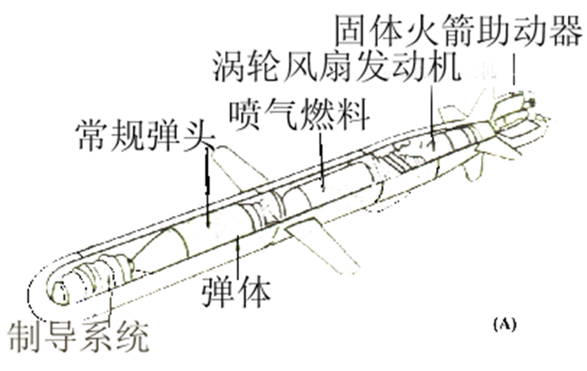
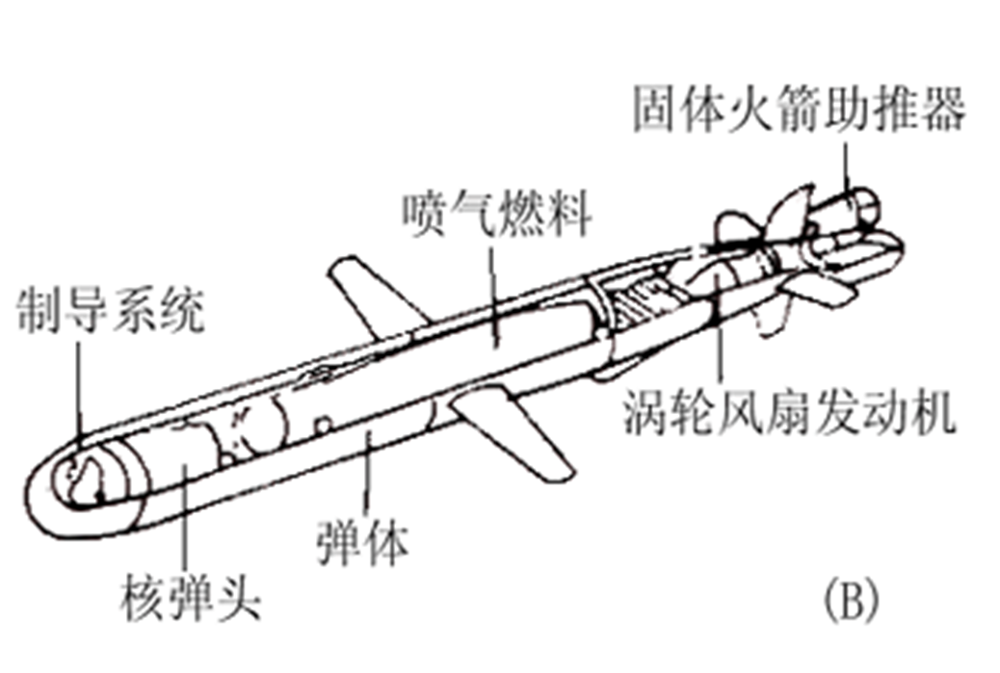
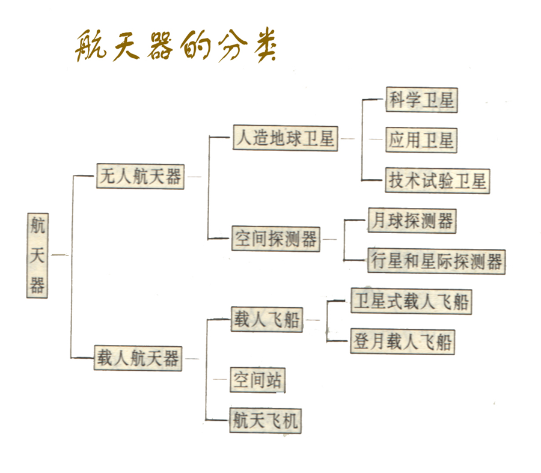

## 古近代军事思想

### 产生，形成，发展，成熟

（一）产生： 夏商
铜戈、玉戈、铜钺
石刀、骨镞、石戈

（二）形成：西周

《军志》、《军政》

（三）成熟：春秋战国

《武经七书》

（四）发展：秦至清

（五）中国近代军事思想

### 代表作

{width="30%"}
{width="30%"}
{width="30%"}

西方古代战争史代表作

{width="30%"}

### 三十六计

- 走为上：全师避敌，左次无咎，未失常也。

- 偷梁换柱：频其更阵，抽其颈旅，待其自败，而后乘之，曳其轮也。

- 无中生有：诳也，非诳也，实其所诳也；少阴，
阴，太阳。

- 笑里藏刀：信而安之，阴以图之；备而后动，勿使有变。刚中柔外也

- 以逸待劳：困敌之势，不以战；损益柔

### 主要内容

1. 战争的起源和性质问题
    - 战争是政治通过暴力手段的继续，是解决阶级之间、民族之间、政治集团之间的矛盾的一种最高形式
2. 战争与政治
3. 战争与经济
4. 战争与主观指导
5. 将帅修养
6. 治军
7. 战略战术
8. 其他制胜保障

## 孙子兵法

## 毛泽东邓小平军事思想

## 中国武装力量构成和发展

## 电子对抗技术

### 发展概要

特点：

- 利用无线电波对对方通讯设备强烈干扰
- 利用假密码或破译的密码进行电子欺骗
- 利用电子设备弹指对方雷达所在地，将至摧毁
- 实施无源干扰

作用：

- 改变军事实力
- 改变传统军事观念
- 改变军事效费比

### 电子对抗级数分类

#### 电子侦查和反侦察

电子侦察：搜集截获敌人点播，从中获取战术，技术特征参数以及位置灯数据情报。主要为无线电侦查和雷达侦查

- 无线电通信侦查
    主要是应用无线电设备，对敌方各种无线电通信设施所发射的无线电通信信号和指挥联络信号进行搜索、定位、检测、识别、记录和分析，从而获取敌方电子设备的技术参数、类别、用途及配置等。主要侦察手段有地面电子侦察站、电子侦察飞机、电子侦察船、电子侦察卫星和投掷式电子侦察器材等。

- 雷达侦查
    是一种敌我双方的行为，它是指用雷达侦察设备（通常称雷达侦察机）截收敌雷达信号，发现敌雷达或带雷达目标，并测定敌雷达的技术参数及其所在的方向或位置。
    优点：
    1. 作用距离远

    2. 获取的目标多而准

    3. 预警时间长

    4. 隐蔽性好

电子反侦察：为了防止敌人截获而采取的措施

- 主要方式

    1. 隐蔽发射频率

    2. 使用定向天线：尽量不要往敌人的方向发送无线电波

    3. 采用频率捷变

    4. 实现电子欺骗

    5. 缩短发射时间和发射次数

- 分类：无线电反侦察和雷达反侦察

    1. 无线电反侦察
        1. 控制发射实际
        2. 控制发射方向和范围
        3. 采用保密通信
        4. 采用不易被侦收的通信方法
    2. 雷达反侦察
        1. 控制雷达发射时间
        2. 控制雷达工作频率
        3. 隐藏雷达和新型雷达的启用必须经过批准（先用雷达被发现的时候，隐藏雷达和新型雷达继续顶上使用）
        4. 设置假雷达，发射假的雷达信号
        5. 适时更换雷达阵地

#### 电子干扰和反干扰

1. 电子干扰：是使敌方电子设备和系统丧失或降低作战使用
效能所采取的措施

    1. 无线电通信干扰
        1. 压制性干扰[《全频道阻塞干扰》]：针对敌方通信的频率发射功率强大的干扰信号，以压制敌方的通信信号，造成敌方通话时语音听不清楚，==通报时报文差错达５０％以上==，目的是使敌方通信联络中断，指挥瘫痪。

        2. 欺骗性干扰：接收错误信息
    2. 雷达干扰：利用雷达干扰设备发射干扰波，或者利用能反射或能衰减的无线电波的器材反射或衰减雷达波，从而达到扰乱敌方雷达的正常工作。分为有源干扰和无源干扰。
        1. 有源干扰：是指一定电磁波辐射源的干扰--积极干扰，需要专门的发射级发射烦扰，分为压制性和欺骗性
            - 欺骗性通常是对跟踪雷达进行距离欺骗和角度欺骗
            - 压制性就是大力出奇迹
        2. 无源干扰：利用干扰器材反射和衰减无线电波的干扰，需要反射型器材。衰减无线电波的干扰器材可称为吸收型干扰器材。
            - 反射型：箔条，电离气悬体，角反射器
            - 吸收型：特殊涂料
            - 隐身级数
!!! tip J20隐身技术
    实际上是一种反射型和吸收型的结合。飞机的外形既要满足空气阻力小，又要满足各个方向上的雷达反射面积尽可能的小，还要保证容量足够大，能够携带足够的电子设备，燃料和导弹（J20为了减重和省空间是没有航炮的，所以在空对空作战中导弹容量至关重要）

2. 电子反干扰--针对地方所释放的各种电子干扰而采取的反措施
    - 无线电通信反干扰：
        - 提高收信端信号强度
        - 采用抗干扰能力强的通信方式
        - 采用扩频技术
    - 雷达反干扰--削弱或者消除地方告饶己方雷达的影响，保证雷达发挥正常效能，而采取的措施
        - 增大雷达的发射功率或者脉冲的宽度
        - 改变雷达工作频率
        - 采用隐藏扫描
        - 提高雷达天线的方向性
        - 采用动目标显示（忽略静止的反射物体）[莫名想到打csgo只有动态视力没有静态视力的我]
3. 电子摧毁和反摧毁
    - 电子摧毁：是指用直接毁伤的方法对敌方电子设备进行破坏，使其丧失作战能力或者降低作战能力的行为
        - 反辐射武器摧毁
        - 核电磁脉冲摧毁
        - 火力摧毁（不必多说）
        - 特工人员摧毁(想到刘慈欣一篇关于蚂蚁和恐龙的科幻小说)
    - 电子反摧毁
        - 采用全部或者部分电子静默（电子摧毁往往是摧毁工作的电子设备，当然火力和特工人员摧毁不算）
        - 减少开机次数和时间
        - 控制开机时机和方向
        - 区分各类电磁频谱
!!! note "“FT2000”反辐射导弹"
    “FT2000”反辐射导弹主要用于攻击敌人电子干扰飞机在2-18GHz范围内发射的雷达、辐射波源。导弹采用被动雷达，并有记忆功能。它应该是全球第一种“纯反辐射防空导弹”，全长6.8公尺，弹径0.466公尺，长径比14.6，重量1.3吨，FT一2000射程为12至100公里，有效射高是3至20公里、这种导弹专门用来打击雷达辐射飞机，如空中电子干扰机、空中预警与系统控制飞机等，可以称之为“预警机杀手”。  装备的搜索雷达为全新的3D传统雷达，主抛物面天线由多个小型圆盘天线构成，采用高频操作。机动性可能超过S-300PMU1的21G和爱国者的25G，以大型导弹而言性能相当杰出。
    该导弹可以同时攻击多个空中辐射源。它具有一个宽频被动雷达导引头，主要用于对付电子干扰机、预警机等空中辐射电波的目标。    一套FT2000系统包括四管垂直导弹发射器，装载在一辆重型卡车上，使用被动反辐射导弹，该系统在外型上与俄罗斯的S-300型地空导弹很相似。

## 精确制导技术

### 介绍

1. 导弹的定义及其组成:动力装置,制导系统,战斗部，具体就是：
    - 弹头
    - 弹体
    - 推进系统
    - 弹上制导设备
    - 弹上电源

2. 制导系统：分为引导系统和控制系统

3. 战斗部：也就是弹头，可分为常规战斗部和核战斗部两大类。

{width=60%}
{width=60%}

4. 导弹武器系统定义及其组成：
    - 导弹
    - 导弹制导系统的地上部分
    - 发射设备
    - 测试设备
    - 运输装填设备
    - 发射控制设备
（感觉只要记住不只只是导弹就好了，具体还得翻书查）

!!! note "美国ATACMS陆军战术导弹系统"
    ATACMS陆军战术导弹系统是美国最新型地对地战术导弹，1991年开始装备美国陆军，取代“长矛”导弹，主要用来攻击敌方一线纵深目标。导弹配用子母弹头，内装950枚子弹头，采用以环型激光陀螺为基础的惯性制导系统，用美国MLRS多管火箭炮发射。海湾战争中，美国陆军在沙特阿拉伯部署105枚ATACMS导弹，发射约30枚，用于攻击伊拉克的机场，后勤中心、战场指挥所、地空和地地导弹发射场。最大射程150公里，弹长3.96米，弹径0.61米，弹重1530公斤，子母弹头重454公斤，子弹杀伤半径15米。圆公算偏差50米

5. 导弹分类
    - 按照作战任务分类
        - 战略导弹：通常装核战斗部
        - 战役导弹：打击敌人战役纵深内重要目标的导弹
        - 战术导弹：直接支援部队战斗行动的导弹
!!! tip
    这里的战役和我原本认知的不一样，原本我认为夺取一个山头，伏击一群敌军是战役，但是翻了一下讲朝鲜战争书，发现一次大的进攻和防守才算一次战役，动辄几个军几个师。
    - 按照射程分
        - 近程导弹：R<1000km
        - 中程导弹: 1000-3000
        - 远程导弹: 3000-8000
        - 洲际导弹: R>8000km
!!! note "美国“民兵3”地对地战略导弹"
    “民兵3”是美国第一处装分导式多弹头的洲际弹道导弹，1970年开始装备美国空军，1975年完成550枚的部署任务，1978年11月结束生产。导弹采用NS-20全惯性制导式子弹头，每个母弹内装有3枚子弹头，导弹动力装置为三级固体火箭发动机，由地下井发射。根据1993年签署的“美俄关于进一步削减和限制进攻性战略武器的协议”，“民兵3”在2003年1月前将削减为500枚，并拆除MK12A分导式多弹头，改装MK21单弹头。射程9800-13000公里，圆公算偏差370-450米（MK12）,185-227米（MA12A），反应时间32秒，弹长18.26米，弹径1.67米，弹重35400公斤，弹头重907 公斤（MK12）995公斤（MK12A）,核弹头当量3×7.5万吨（MK12）3×33.5 万吨（MK12A）
!!! note "美国“掠夺者”反坦克导弹"
    “掠夺者”是美国自1990年开始研制的单兵便携式近程反坦克导弹，目的是为了满足海军陆战队近距离反坦克和市区反坦克作战的需要。目前处于工程制造阶段，2001年装备部队。
    系统全重8公斤，与一般火箭筒重量相仿。弹长860毫米，弹径140毫米，初速34.8米/秒，最大飞行速度300米/秒，射程17/700米。能在狭窄空间发射，适合于城市巷战。配有自锻破片战斗部和双模传感器，能攻击坦克顶部。
!!! note "中国东风-41洲际弹道导弹"
    东风-41是一种注重快速实现全球范围内核打击任务的远程洲际导弹，与同类西方国家第三代洲际导弹技术处于同类水平，固体发动机、多导分弹头、精准突防能力是其主要特点，射程在12000公里~15000公里之间，在中国东北和西北地区发射能够覆盖美国本土和北约地区，核弹头当量预计将达到50万吨。中国火箭军发展部队与国外有着很大区别，体系化信息化已经能完全覆盖，东风-31A/B、东风-5A/B、东风-41、东风-16/10等战略导弹体系已经初步完成，中国核战略威慑逐渐提升，适应中国国力发展

### 精确制导武器

- 地地、地空、地舰、地潜
- 空空、空地、空舰、空潜
- 舰舰、舰地、舰空、舰潜
- 潜潜、潜地、潜空、潜舰
- 西方分法（面- SURFACE、空- AIR ）有：SS、SA、AA、AS

定义：精确制导武器是指直接命中概率超过50%的制导武器。直接命中的含义是指制导武器的圆概率误差（也叫圆公算偏差，表示符号ＣＥＰ，即英文Ｃircular Error, Probable的缩写）小于该武器弹头的杀伤半径。 

特点：

1. 采用导引、控制系统或装置，调整受控对象（导弹、炸弹、炮弹等）的运动轨迹，使之完成规定的任务
2. 命中精度高。常用圆公算偏差来衡量导弹或炮弹的命中精度。圆的半径越小，说明导弹命中精度越高
3. 总体效能高。精确制导武器的效能是用精度、威力、射程、重量、尺寸、效费比、可靠性、全天候作战能力等主要战技指标来衡量的。在性能覆盖的基础上，突出一两项的指标，作战效能就能达到最佳的发挥，即最佳的总体效能。 

### ==精确制导系统==

==制导系统：导引+控制==

*导引系统*：对重心进行控制
*控制系统*：对角动量进行控制

制导系统分类：

- 自主式制导：特点是弹体的飞行完全自主，因而不易受干扰。但由于制导程序是预先确定的，所以这种制导方式只适于攻击地面固定目标。
    - 相关制导 －－地形匹配制导、数字景象匹配制导、程序制导

- 遥控式制导
    - 指令制导－－有线电指令制导、无线电指令指导、电视指令制导
    - 波束制导－－雷达波束制导 、激光波束制导

{width=60%}
{width=60%}

- 寻的式制导:特点：多用于空空导弹、地空导弹上。  
    - 主动式寻的制导
    - 半主动式寻的制导
    - 被动式寻的制导
- GPS制导:利用弹上安装的ＧＰＳ接收机接收==4颗==以上导航卫星播发的信号，来修正导弹的飞行路线，提高制导精度。 
- 复合制导
- 惯性制导：惯性制导是指利用陀螺仪、加速度表等惯性仪表组成的测量装置，按惯性原理控制和导引导弹飞向目标的制导方式。 

世界主流的导弹种类：【具体还是要抄书吧】
１．防空导弹
２．反坦克导弹
３．空空导弹
４．空地（舰）导弹 
5. 地地战术弹道导弹
６．巡航导弹

## 军事航天技术

没啥可说的，除了这几张以外都是案例

{width=60%}
{width=60%}
{width=60%}
