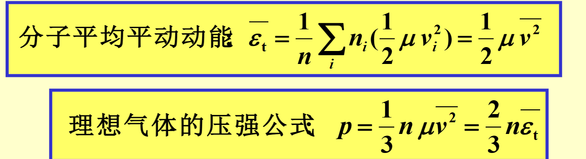
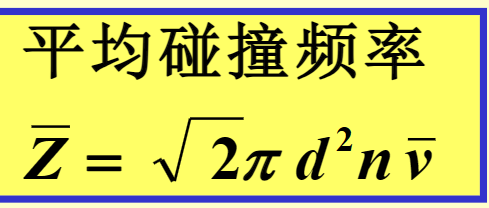
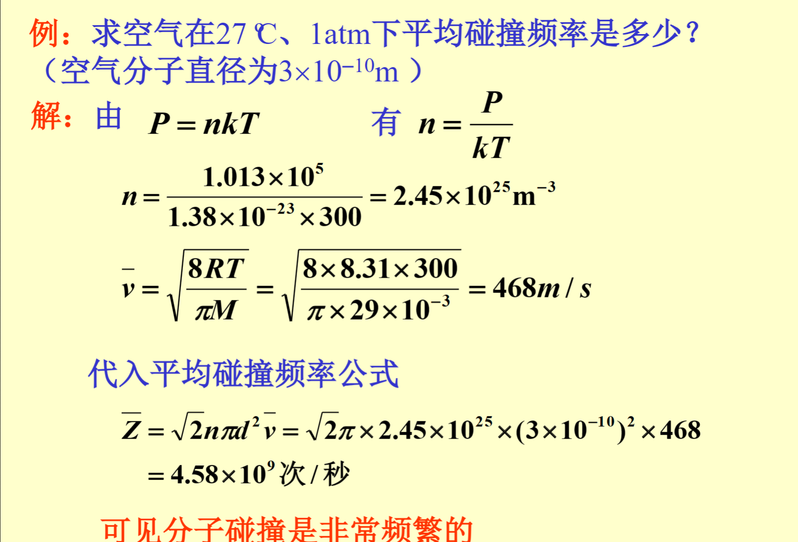
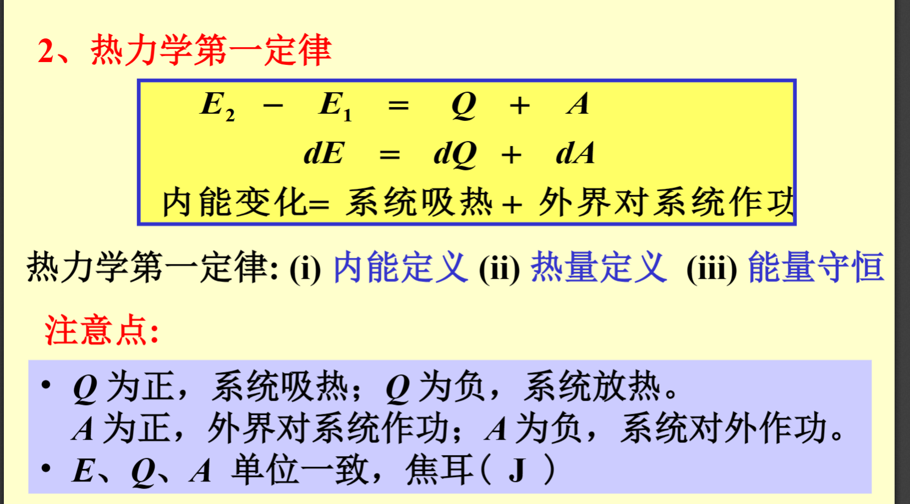

三维的速度只有一维是能作用在墙壁上的

默写三个速率的表达式

理想气体的内容，只能是温度的单值函数

水分解之后，这个气体的摩尔数多了，所以就会有更多的双分子气体参与到运动中，也就吸收热量变成内能

平均的碰撞频率需要用公式计算
平均碰撞频率都是在$10^9$这个数量级的

每一个分子的不可压缩体积都是自身分子核的四倍大小
气体分子的引力作用削弱分子碰撞器壁的动量

-A系统对外做功
A外界对系统做功
Q系统吸热
E系统内能增量

准静态过程中功的计算$\int_{a}^{b} P \, dV$
